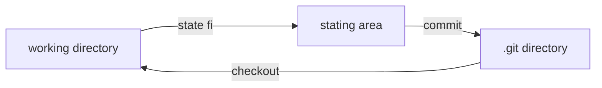
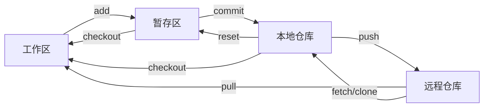

# git 培训

## 前言

- 版本控制方式

  lock-modify-unlock

  cop-modify-merge

- 类型

  本地版本控制

  集中式版本控制

  分布式版本控制

- svn

  特点

  > 统一的文件版本
  >
  > 对目录的版本控制
  >
  > 文件的复制重命名
  >
  > 高效的分支和标记
  >
  > 支持事务性的提交

- svn概念

  > repository：文件仓库
  >
  > workcopy：工作拷贝
  >
  > checkout：检出
  >
  > checkin：检入
  >
  > commit：提交
  >
  > update：更新
  >
  > revison：修订版本
  >
  > tag：标签
  >
  > branch：分支
  >
  > confilct：冲突
  >
  > head：主版本

- svn常见目录

  > project
  >
  > > doc
  > >
  > > > 产品
  > > >
  > > > 设计文档
  > > >
  > > > 测试
  > > >
  > > > 质控
  > >
  > > code
  > >
  > > > trunk
  > > >
  > > > branch
  > > >
  > > > tags
  > >
  > > debug
  > >
  > > release

- 常见操作

  ```
  创建仓库
  取出代码
  本地文件添加到仓库
  删除文件
  文件/目录改名
  提交修改后的文件
  更新本地文件
  比较不同版本文件
  创建标签
  创建分支
  合并一个分支到主干
  两个分支合并
  查看版本分支图
  清理
  ```


## git





- 用户配置

  ``git config --system user.name ""``

  ``git config --system user.email ""``

  ``git config --system --unset user.name``

  global 	system	local

- 创建项目

  ```
  git init		//初始化仓库（文件加）
  git remote add origin		//添加远程仓库
  git clone	[url]	//clone仓库到本地
  git clone -b [name] [url]//clone分支
  ```

- 撤销

  ```
  git reset hard		//回退work state reponsitory
  ```

- 分支管理

  ```
  git branch
  git checkout -b name 
  git branch name
  git checkout -b dev origin/dev
  git merge  name
  
  ```

- 场景

  发布已有项目

  克隆已有仓库

  新增代码提交

  获取远程仓库提交

  创建新分支

  切换分支

  分支合并

  取消合并

  代码暂存

  代码暂存还原

  解决冲突

# maven

maven是一个项目管理构建工具

项目对象模型pom

> 关系
>
> 环境
>
> 行为

坐标

> groupId artifactId version 定义了唯一性

依赖

> 配置
>
> > groupid versionid artifactid
> >
> > scope
> >
> > exclusion
>
> 范围
>
> > compile
> >
> > test
> >
> > provided
> >
> > runtime
> >
> > system
>
> 传递
>
> > a->b b->c a->c
>
> 依赖调解
>
> > 1.路径最近者
> >
> > 2.路径相同，第一申明优先
>
> 依赖排除
>
> 可选依赖
>
> 归类依赖
>
> 依赖问题排查
>
> > mvn dependency:list
> >
> > mvn dependency:tree
> >
> > mvn dependency:analyze
>
> 依赖仲裁
>
> > 父项目;DependencyManagerment
>
> 生命周期
>
> >lifecycle
> >
> >phase
> >
> >goal
> >
> >lifecycle->n个phase->n个goal
> >
> >validate
> >
> >compile
> >
> >test
> >
> >package
> >
> >verify
> >
> >install
> >
> >deploy

- 命令

  clean package

  dev

  