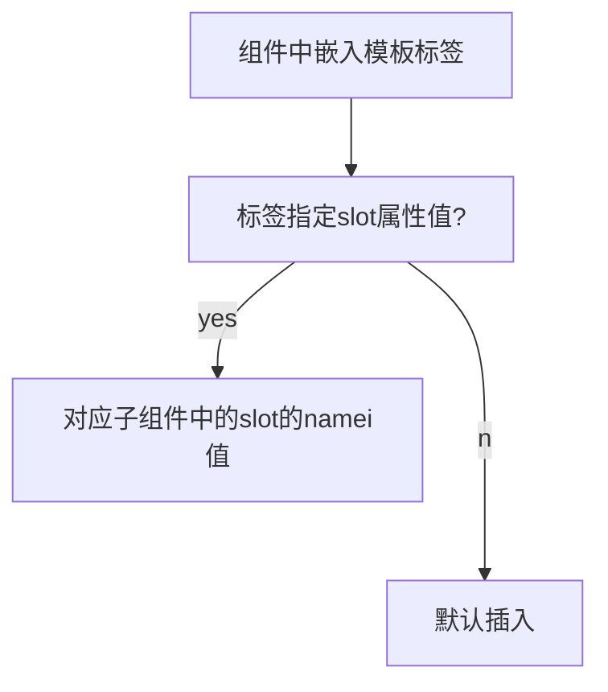
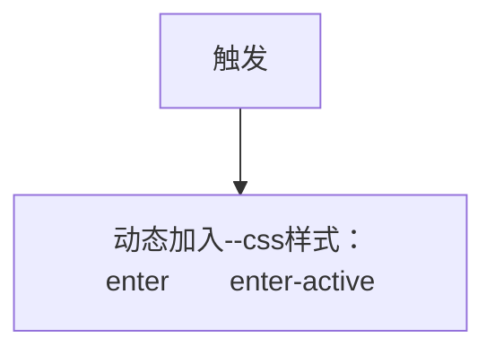
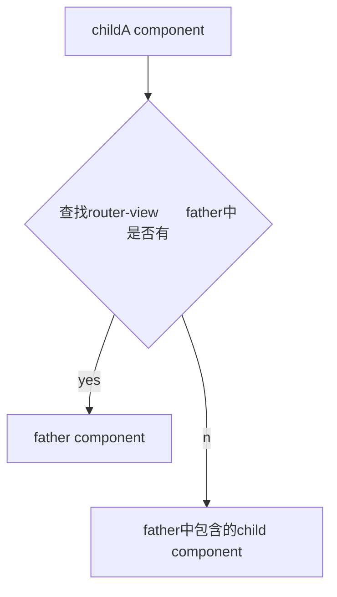
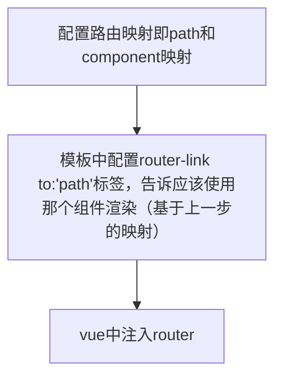

# vue学习记录

- 目录结构

  > public 
  >
  > src
  >
  > > assets
  > >
  > > components
  >
  > .gitignore
  >
  > babel.config.js
  >
  > package.json			//依赖配置文件
  >
  > package-lock.json
  >
  > README.md

- 

- 命令

  ```
  npm run serve		//启动项目
  npm 
  ```

  


- 技术栈规范：选择成熟且稳定的技术作为生产环境。
- 命名贵方：组件-大驼峰、

## vue生命周期

- new vue()------>init events & lifecycle------->init injections & reactivity------->初始化template------>挂载template----->destory
- render 渲染相应的vue文件，挂载模板通过定位index的id=“” 然后进行整个div的替换

```
两种方式：
new vue({
	render: h =>h(App),
	}).$mount('#app')
new Vue({
    el:"#app"，			//声明挂载点
    template:"<App/>		
	componients:{App}
})
```


## vue事件

```
<button v-on:click="count+=1“></button>
<button v-on:click="dosomething(100,$event)></button>
```


## vue指令

```
v-once 		//内容后期不会改变（vue是响应式的）
v-html		//将数据作为html解析，注意数据中的数据绑定将会失效
v-bind		//使用v-bind:id="xxx",绑定属性和键值
vi-bind简写：v-bind:href="xx"  等价于	:href="xx"
v-if		//内容是否显示，true显示，false不渲染
v-on		//监听dom事件
v-on简写：	v-on:click	等价于 @click
v-show		//只是简单的改变class的display属性


```


- 参数

  > 动态参数：使用[atrributename],attributename是个变量，值为data中定义的。避免使用大写，浏览器会将attribute名全部强制转为小写

- 修饰符

  > `.`指定特殊的后缀，表面 事件特定触发
  >
  > > prevent:调用event.prevenDefault();


## 计算属性

```
 computed: {
    // 计算属性的 getter
    reversedMessage: function () {
      // `this` 指向 vm 实例
      return this.message.split('').reverse().join('')
    }
  }//基于缓存，较于方法
  
```


## 父子组件传值

* 子到父

  通监听dom的操作然后调用$emit("handle")传递事件名，在父组件中监听事件名

  

  ```
  <Button @handle='dosome'></Button>				//父组件，dosome是父组件中定义的
  												//函数
  												//
   <el-button @click="$emit('handle',1)" size="">1</el-button> 	//子组件
   
  ```

  ```mermaid
  graph TB
  a[子组件事件触发传递事件名]
  
  b[父组件中调用子组件中监听传递的事件名]
  
  c[事件发生父组件调用函数]
  a-->b
  b-->c
  
  
  
  ```

* 父到子

  子组件中定义`props：['attribute']`，父组件调用子组件时利用`:attribute="father-attribute"`

* 总结

  ```mermaid
  graph TB
  a[props定义动态变量]
  b[父组件将该变量v-bind绑定值]
  c[子组件得到值]
  a-->b
  b-->c
  
  ```

  


## 插槽

`<slot></slot>`

理解：将组件进一步细化，使得页面更加灵活。组件：划分页面模块。插槽：作用于单个组件

使用场景：父组件调用子组件，向子组件中传递显示内容。（抽象设计组件，便于动态改变组件）




## 动画




* 自定义

  动画网站：<https://daneden.github.io/animate.css/>

  js动画：https://veloci


## vuex

- state 存放数据

- getter 类似computed

- mutation 定义如何改变数据（仅同步）

- module 多模块

- action什么时候改变数据（支持异步）

  ```mermaid
  graph TB
  a[vue 组件]
  b[action]
  c[mutation]
  d[state]
  a--dispatch-->b
  b--commit-->c
  c--mutate-->d
  d--render-->a
  ```

- store写法

  ```
  
  ```

  *注意在main.js的vue的实例中引入vue*

## router

`<router-view/>`







- 动态路径参数（path）

  `path:/user/:id component:user`

  ```mermaid
  graph TB
  a[请求/user/123]
  b[id与123绑定通过':']
  c["id该变量送入this.$router.params.id"]
  d[user组件将可获取该值,再根据值进行渲染]
  a-->b
  b-->c
  c-->d
  
  ```

  通过设置props:true 可是的跳转的组件可以使用绑定的变量{{id}},通过路由传递的。

  （*对比父对子传值*）

  使用场景：高度复用的组件。多个path映射一个component

- 守卫